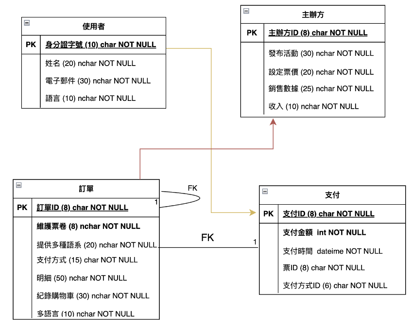

# 多語言購票系統 🎫

資料庫管理課程作業，以 MySQL 設計的多語言演唱會購票系統資料庫，涵蓋系統需求分析、E-R 圖設計、資料表正規化與功能測試。

---

## 系統背景

隨著全球演唱會市場擴張、粉絲語言多樣化，單一語言系統限制了非母語使用者的參與。**多語言購票系統**提供便利性，增加粉絲滿意度及主辦方收益。

---

## 系統需求

- 支援三種票券：早鳥票、VIP 票、一般票
- 語言選擇：中文、英文、日文、韓文、法文、德文等
- 支付方式：Line Pay、Apple Pay、Visa、信用卡、街口支付
- 額外功能：剩餘票數即時更新、演唱會倒數計時、QR Code 電子票券

---

## 資料庫設計

### E-R 圖



### 資料表

本系統共設計 4 張資料表：

**使用者**

| 欄位 | 型別 | 長度 | 說明 |
|------|------|------|------|
| 身分證字號 (PK) | char | 10 | 主鍵 |
| 姓名 | nchar | 20 | |
| 電子郵件 | nchar | 30 | |
| 語言 | nchar | 10 | 偏好語言 |

**主辦方**

| 欄位 | 型別 | 長度 | 說明 |
|------|------|------|------|
| 主辦方ID (PK) | char | 8 | 主鍵 |
| 發布活動 | nchar | 30 | |
| 設定票價 | nchar | 20 | |
| 銷售數據 | nchar | 25 | |
| 收入 | char | 10 | |

**訂單**

| 欄位 | 型別 | 長度 | 說明 |
|------|------|------|------|
| 訂單ID (PK) | char | 8 | 主鍵 |
| 維護票券 | nchar | 20 | |
| 提供多種語系 | nchar | 20 | |
| 支付方式 | char | 15 | |
| 明細 | nchar | 50 | |
| 記錄購物車 | nchar | 30 | |
| 多語言 | nchar | 10 | |

**支付**

| 欄位 | 型別 | 長度 | 說明 |
|------|------|------|------|
| 支付ID (PK) | char | 8 | 主鍵 |
| 支付金額 | int | - | |
| 支付時間 | datetime | - | |
| 票ID (FK) | char | 8 | 關聯訂單 |
| 支付方式ID | char | 6 | |

### 正規化分析

所有資料表均通過 **1NF、2NF、3NF** 正規化驗證：
- **1NF**：所有欄位皆為最小單元（Atomic value）
- **2NF**：除主鍵外，所有欄位與主鍵相依
- **3NF**：除主鍵外，欄位之間無功能性相依

---

## 如何使用

### 環境需求

- MySQL 8.0 以上

### 匯入資料庫

```bash
mysql -u root -p < database/schema.sql
```

或在 MySQL Workbench 開啟 `database/schema.sql` 執行。

---

## 測試案例

| 測試項目 | 說明 |
|---------|------|
| 用戶登錄測試 | 以身分證字號查詢使用者資料 |
| 購票流程測試 | 新增訂單與支付記錄，驗證資料正確寫入 |
| 座位選擇邊界測試 | 驗證選票數量介於 1～6 張之間 |

---

## 檔案結構

```
language-ticket-system/
├── database/
│   └── schema.sql     # 資料庫建立、資料表與測試資料
├── docs/
│   └── 語言購票系統.docx  # 完整系統分析報告
└── README.md
```

---

## 學習成果

- 從需求分析到 E-R 圖設計的完整資料庫設計流程
- 實作資料表正規化（1NF、2NF、3NF）
- 設計購票系統的多語言、多支付方式資料結構
- 撰寫 SQL 功能測試腳本驗證系統行為
